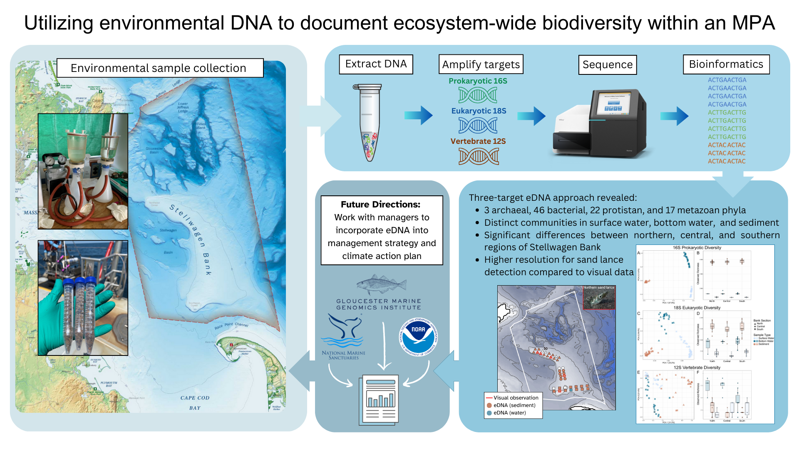
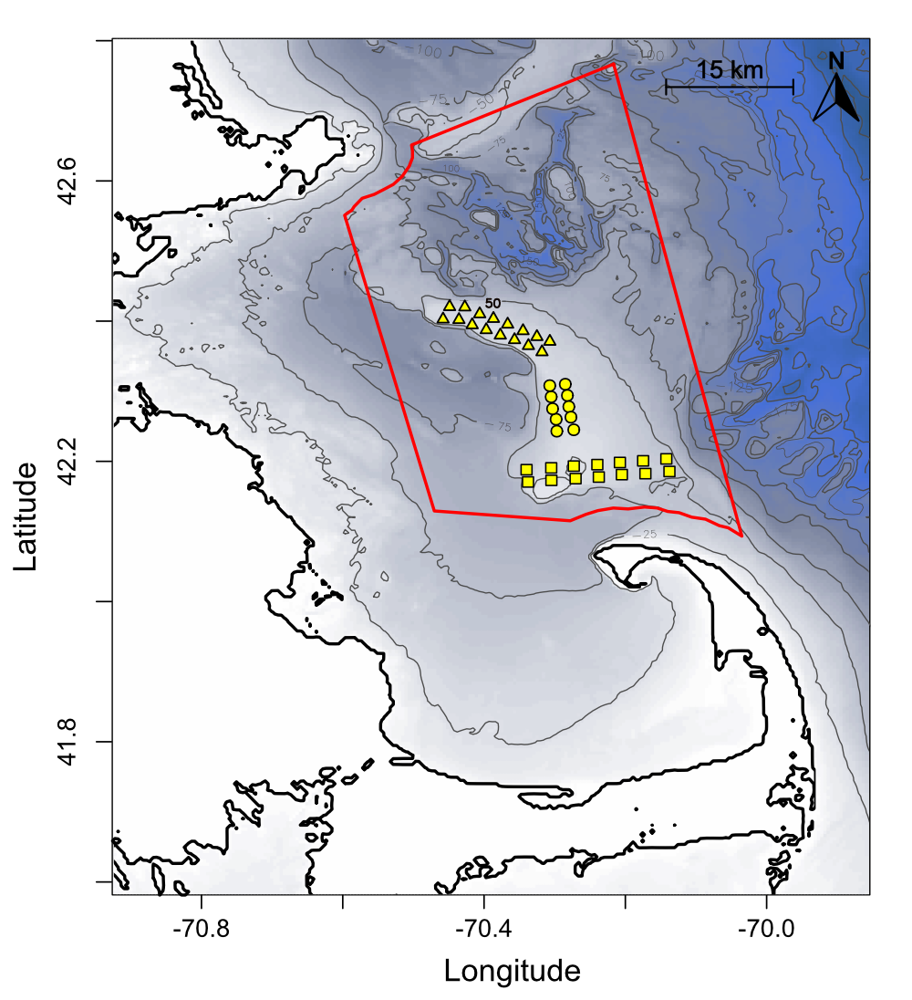
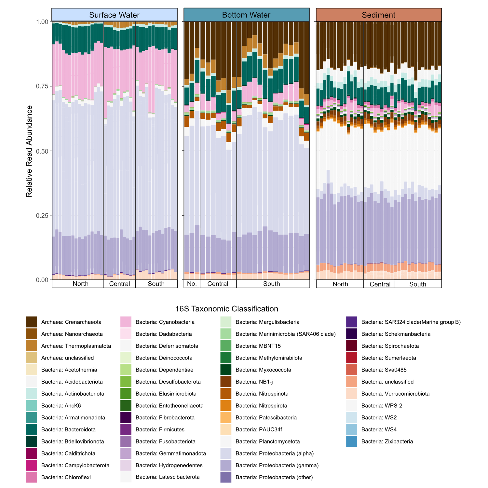
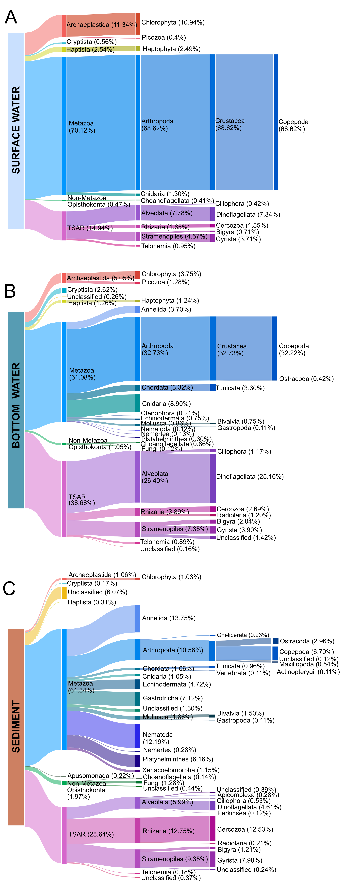
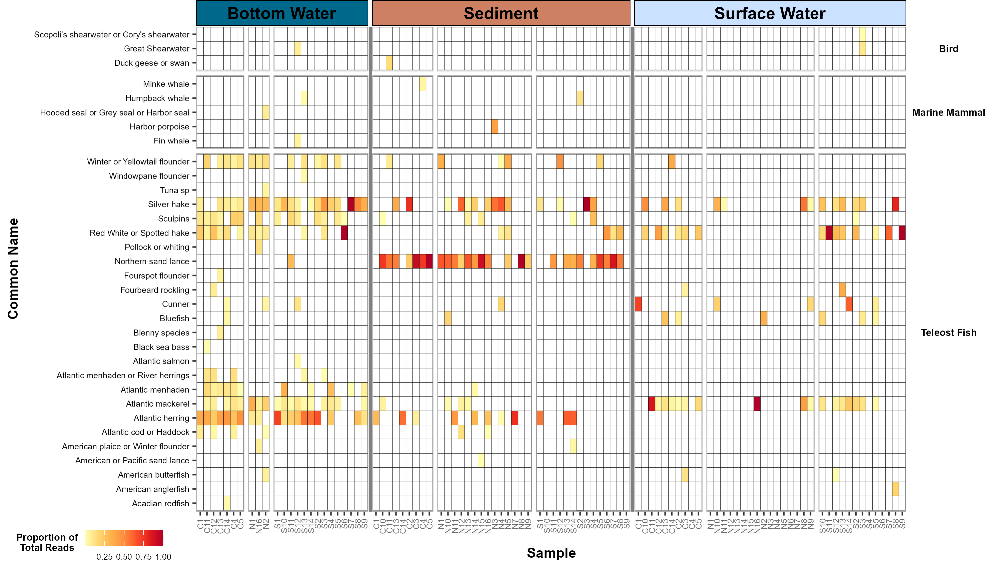

# Ecosystem-wide biodiversity with environmental DNA to inform management of the Stellwagen Bank National Marine Sanctuary

The purpose of this study was to test the utility of environmental DNA (eDNA) to assess whole ecosystem biodivesity using a suite of metabarcoding targets - 16S for prokaryotes, 18S for eukaryotes, and 12S for vertebrates.  
  
Surface water, bottom water, and sediment were collected from 41 survey sites spanning the Stellwagen Bank underwater plateau in July 2021 during a sand lance survey conducted by the SBNMS sanctuary team. 

 
*Map of sampling locations within Stellwagen Bank National Marine Sanctuary (SBNMS) within the Gulf of Maine off the coast of Massachusetts (USA). Red line denotes the sanctuary boundaries. Yellow points represent sampling locations, with shapes indicating the different sections designations used for downstream analysis (triangle = north, circle = central, and square = south).*  
  
  
# Results
## Prokaryotic diversity (16S)

*Relative read abundance of prokaryotic taxa from 16S SSU rRNA sequencing. Surface and bottom waters bars each represent an individual sample taken at a site. Sediment bars are the combined diversity seen in triplicate samples collected at each site.*  
  

## Eukaryotic diversity (18S)

*Sankey diagrams of curated taxa representing more than 0.1% of the total 18S sequencing reads for each sample type: (A) surface water, (B) bottom water, and (C) sediment.*  
  

## Vertebrate diversity (12S)

*Proportion of total rea  ds assigned to teleost fish, marine mammals, and birds from 12S V5 sequencing. Each column in surface and bottom water represents an individual sample while columns in sediment include triplicate samples combined.*  

